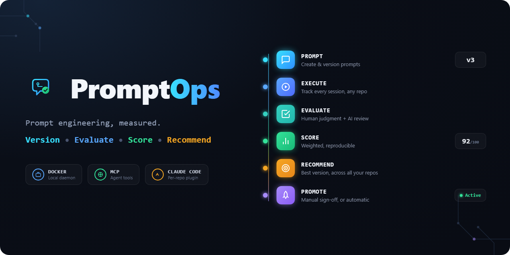

  

# PromptOps

Prompt versioning, evaluation, and continuous improvement for AI-assisted development.

## The problem

As a developer works — writing code, running tests, debugging, reviewing — the prompts and instructions given to an AI coding assistant naturally fall into different *activities* (fix a bug, write a test, review a PR, scaffold an endpoint). An assistant gives better results when the prompt for a given activity is tailored to that kind of work, and better still when that prompt keeps improving as it gets used more — shaped by what has actually worked, not just whatever a developer happened to type that day.

Today that improvement, if it happens at all, lives entirely in a developer's head: a vague sense that "this phrasing tends to work better," rediscovered by feel, forgotten between sessions, and lost every time work moves to a new project.

PromptOps treats prompts as versioned engineering assets and measures their effectiveness using evidence — build success, test results, static analysis findings, review iterations — alongside structured human and AI evaluation, instead of relying purely on gut feel about whether an interaction "went well." Because that evidence is captured per developer rather than locked to a single repository, none of it is lost when starting a new project: a prompt version that worked well on one codebase, and the evidence for *why* it worked, is immediately available as a starting point on the next one.

## What PromptOps is — and isn't

**It is** an engineering telemetry platform for AI-assisted development: versioned prompts, a record of every execution and the context around it, objective engineering metrics, human and AI evaluation, and a scoring/recommendation engine that surfaces which prompt version to reach for next.

**It is not** a prompt library or snippet manager — saving and tagging prompt text is a small part of it, not the point. **It also does not (yet) rewrite prompts for you** — today it measures and recommends; a human decides what to change, unless you opt into automatic promotion (see [`docs/promotion-policy.md`](docs/promotion-policy.md)).

Concretely, it:

- Versions prompts and tracks their evolution over time
- Records every prompt execution along with the development context around it (repo, branch, commit, task, referenced docs/ADRs, acceptance criteria)
- Automatically collects objective engineering metrics (build, test, coverage, static analysis, review activity) where possible
- Captures structured human evaluation and AI-judged evaluation, kept separate from each other
- Scores prompt effectiveness from configurable, weighted combinations of the above
- Recommends the best-performing prompt for a given kind of task, drawing on history across all of a developer's projects
- Supports multiple AI providers (Claude Code today; ChatGPT, Copilot, local models by design, not by hardcoding)

## How it works

PromptOps runs as a small local daemon (Docker) on your machine — started once, not per project — that owns your prompt history and evaluation data. Each repository gets a thin Claude Code plugin: hooks that capture context and execution data automatically, and slash commands (`/promptops init`, `/promptops rate`, `/promptops evaluate`, `/promptops recommend`, `/promptops history`) for anything that needs a human. Because every repo talks to the same local daemon, a recommendation on a brand-new project can draw on history from every other project on your machine — nothing is siloed per repo, and nothing leaves your machine.

For a stage-by-stage walkthrough of what happens from the moment you type a task to the moment a better prompt gets recommended next time, see **[`docs/promptops-flow.html`](docs/promptops-flow.html)** (open it locally in a browser, or download it via GitHub's "raw" view — GitHub doesn't render `.html` files inline).

## Get started

1. **[`docs/getting-started.md`](docs/getting-started.md)** — the practical, step-by-step walkthrough for new installations and upgrades: start or update the daemon, install/upgrade the plugin, seed starter prompts, and run evaluations. Start here.
2. **[`docs/daemon-setup.md`](docs/daemon-setup.md)** — the one-time daemon setup in more detail (Docker, data persistence, upgrades, metric-collector plugins).
3. **[`docs/installing-promptops.md`](docs/installing-promptops.md)** — the per-repo Claude Code plugin in more detail (hooks, skills, what each one does).

## Learn more

- **[`docs/architecture.md`](docs/architecture.md)** — architecture decisions (ADRs) and full design rationale.
- **[`docs/project-plan.md`](docs/project-plan.md)** — the phased build-out, including what's still on the roadmap.
- Every capability has its own doc, each covering its domain model and design decisions in depth: [prompt repository](docs/prompt-repository.md) · [execution tracking](docs/execution-tracking.md) · [engineering metrics](docs/metrics.md) · [plugin authoring](docs/plugin-authoring.md) · [human evaluation](docs/human-evaluation.md) · [AI evaluation](docs/ai-evaluation.md) · [scoring](docs/scoring.md) · [recommendations](docs/recommendations.md) · [semantic search / knowledge base](docs/knowledge-base.md) · [promotion policy](docs/promotion-policy.md)
- **[`CONTRIBUTING.md`](CONTRIBUTING.md)** — working on PromptOps itself: project status, solution layout, building and testing.
